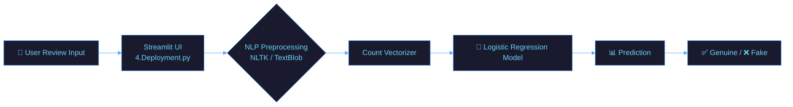

<!-- ═══════════ ANIMATED HEADER ═══════════ -->

# 🕵️‍♂️ Fake Review Detector

<div align="center">
<!-- ═══════════ TYPING ANIMATION ═══════════ -->

<br/>

<!-- ═══════════ BADGES ═══════════ -->

&nbsp;

&nbsp;

&nbsp;


<br/>

[](https://fakereviewdetectorv1.streamlit.app/)
&nbsp;

&nbsp;

&nbsp;

&nbsp;

&nbsp;


</div>

---

## 🌊 What is Fake Review Detector?

**Fake Review Detector** is a Machine Learning application designed to identify fraudulent online consumer reviews. It utilizes Natural Language Processing (NLP) to distinguish between genuine and fake reviews using an Amazon dataset.

Whether you're safeguarding business credibility or protecting customers from review fraud — **Fake Review Detector** has you covered.

> *"Analyze. Detect. Protect. — Safeguarding the authenticity of online feedback."*

### ✨ Core Philosophy
- 🎯 **Accuracy first** — multiple classifiers trained for high precision
- ⚡ **Speed** — efficient deployment via Streamlit
- 🔌 **Accessibility** — simple user interface for instant text classification

---

## 🚀 Features

<div align="center">

| Feature | Description | Status |
|---------|-------------|--------|
| 🕵️ **Fraud Detection** | Identifies fake reviews vs. real reviews | ✅ Active |
| 🤖 **Supervised Learning** | Utilizes Logistic Regression (85% Accuracy) | ✅ Active |
| 💡 **Text Preprocessing** | Advanced NLP pipelines with TextBlob & NLTK | ✅ Active |
| 🌐 **Web Frontend Interface** | Interactive Streamlit application | ✅ Active |
| 📓 **Jupyter Notebooks** | Full EDA and model training pipelines provided | ✅ Active |

</div>

---

## 🛠️ Tech Stack

<div align="center">

### 🧠 AI / Backend


### 🌐 Frontend


### 🔧 Tools & DevOps


</div>

---

## 🗂️ Project Structure

```
📦 Fake-Review-Detector/
├── 📓 1.Inital_Data_Exploration (Notebook One).ipynb        ← Data analysis
├── 📓 2.Text_EDA_&_PreProcessing (Notebook Two).ipynb       ← Text processing
├── 📓 3.Model Implementation and Evaluation (Notebook Three).ipynb ← ML Modeling
├── 📄 4.Deployment.py                                      ← Streamlit App
├── 📁 data and pickle files/                               ← Models & Data
└── 📖 README.md                                            ← Project documentation
```

---

## ⚙️ Architecture Overview



---

## 🚦 Quick Start

### Prerequisites

```bash
# Make sure you have Python installed
python --version

# Clone the repository
git clone https://github.com/Umangpandey75/Fake-Review-Detector.git
cd Fake-Review-Detector

# Install required packages
pip install -r requirements.txt
```

### 🖥️ Run the Web Interface

```bash
# Start the Streamlit application
streamlit run 4.Deployment.py
```

### 📓 Explore the AI Pipeline (Jupyter Notebooks)

```bash
# Start Jupyter Notebook
jupyter notebook

# Follow the notebooks in order:
# 1 -> 2 -> 3
```

---

## 🎮 How to Use

<div align="center">

```
  Step 1             Step 2              Step 3              Step 4
     🌐                 📝                  🧠                  📊
Open Browser  →  Enter Review    →  Click 'Check'  →  View Prediction
 Streamlit UI      "Great product!"    Processing      Genuine / Fake
```

</div>

### 📊 Model Performance

| Metric | Score |
|--------|-------|
| **Accuracy** | 85% |
| **Precision** | 80% |
| **Recall** | 92% |
| **F-1 Score** | 85% |

---

## 📸 Interface Preview

<div align="center">

> 🌙 **Minimalist Streamlit UI** — simple, clean, and focused

```
┌──────────────────────────────────────────┐
│                                          │
│  Fraud Detection in Online Consumer...   │
│                                          │
│   [+] Abstract                           │
│   [+] Related Links                      │
│                                          │
│  Fake Review Classifier                  │
│  ┌────────────────────────────────────┐  │
│  │ Enter Review:                      │  │
│  │ "This product broke on day one."   │  │
│  └────────────────────────────────────┘  │
│                                          │
│          [   Check   ]                   │
│                                          │
│   ✅ The review entered is Legitimate.   │
│                                          │
└──────────────────────────────────────────┘
```

</div>

---

## 🔬 NLP Pipeline

The core text preprocessing lives inside the app:

```python
import streamlit as st
import pickle

# 1. Load trained models
model = pickle.load(open('data and pickle files/best_model.pkl','rb')) 
vectorizer = pickle.load(open('data and pickle files/count_vectorizer.pkl','rb')) 

# 2. Text preprocessing (Spelling correct, stemming, stopwords)
cleaned_review = text_preprocessing(text)

# 3. Vectorization and Classification
process = vectorizer.transform([cleaned_review]).toarray()
prediction = model.predict(process)

if prediction == 'True':
    st.success("The review entered is Legitimate.")
else:
    st.error("The review entered is Fraudulent.")
```

---

## 🔮 Future Enhancements

- 🌍 **Diversified Dataset:** Expand beyond UK grocery reviews to multiple regions and product categories.
- 📉 **Bias Reduction:** Address the predominantly positive sentiment bias in the current dataset.
- 🧠 **Standardized Benchmark:** Contribute to developing a standardized dataset for detecting fraudulent reviews, similar to modern email spam detection systems.

---

## 🤝 Contributing

Contributions are what make the open-source community amazing! Here's how you can help:

```bash
# 1. Fork the repository on GitHub
# 2. Create your feature branch
git checkout -b feature/AmazingFeature

# 3. Commit your changes
git commit -m '✨ Add AmazingFeature'

# 4. Push to the branch
git push origin feature/AmazingFeature

# 5. Open a Pull Request 🎉
```

---

## 📜 License

Distributed under the **MIT License**. See `LICENSE` for more information.

---

## 👨‍💻 Author

<div align="center">

### **Umang Pandey**
*Python Developer · Data Analyst · ML Engineer*

[](mailto:umangpandey.co@gmail.com)
&nbsp;
[](https://linkedin.com/in/umang-pandey-01b486273)
&nbsp;
[](https://github.com/Umangpandey75)
&nbsp;
[](https://umangpandey.vercel.app)

*"Query the data. Build the insight. Ship the WOW. ✨"*

</div>

---

## ⭐ Show Your Support

If **Fake Review Detector** helped you, please give it a ⭐ — it means the world!

<div align="center">

[](https://github.com/Umangpandey75/Fake-Review-Detector/stargazers)
&nbsp;
[](https://github.com/Umangpandey75/Fake-Review-Detector/fork)
&nbsp;
[](https://twitter.com/intent/tweet?text=Check+out+Fake-Review-Detector+by+%40Umangpandey75!+%F0%9F%95%B5%EF%B8%8F%E2%80%8D%E2%99%82%EF%B8%8F%F0%9F%A4%96&url=https://github.com/Umangpandey75/Fake-Review-Detector)

</div>
---
<!-- ═══════════ FOOTER WAVE ═══════════ -->


<div align="center">

*Made with ❤️ by [Umang Pandey](https://github.com/Umangpandey75) · © 2026 Fake Review Detector*


</div>
